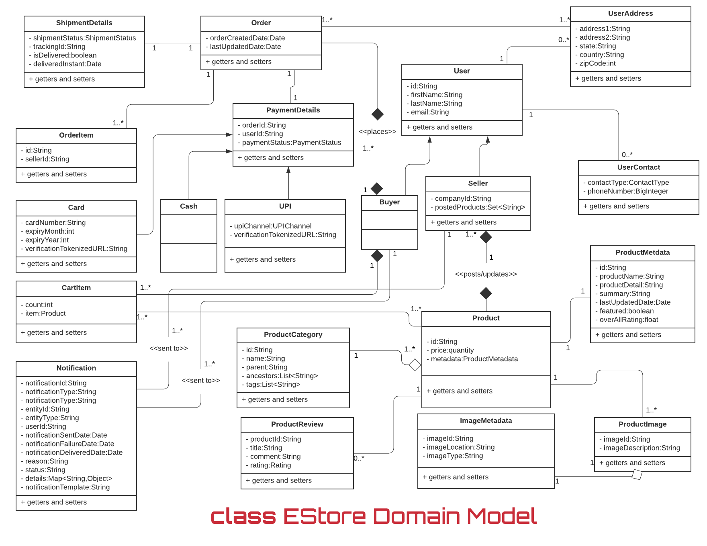

# EStore-app
The project is a Ecommerce app built on Spring Boot, MongoDB, RestWeb Services, Spring Security, JMS, SQS etc.

The below variables must be set in application.properties in order for the application to work properly and also for tests to run.

```shell
cloud.aws.region.accessKey= <<your secret key>>
cloud.aws.region.secretKey= <<your secret key>>
mailgun.key= <<your secret key>>
mailgun.user= <<your secret user>>
mailgun.pass= <<your secret key>>
mailgun.host= <<your secret mailgun domain>>
```
- The application has been tested with Windows OS and Insomnia to test api. A sample yaml file is present in `src/main/resources/insomnia` folder with name `Estore_Requests.yaml`.
In order to quickly test api, download Insomnia free version and import yaml file.

- The application is built with MongoDB database, sample bson files are exported in `src/main/resources/mongo` with folder name `EStore`. To import all bson files and have a quick 
glance at all collections, download Mongo database tools and use below command in Mongo database tools directory after your connection with Mongo http://localhost:27017 is established.
```shell
./mongorestore -d EStore "F:\mongo\EStore"
```
You will have to take out `mongo` folder from `src/main/resources` and place it wherever you want. I have placed it in `F:\mongo\Estore`. After running the command you should be able to see all your collections.

- The application is integrated with swagger. To have a look at all rest api with requests and response, you may hit http://localhost:8084/swagger-ui.html#/.
Please note that `8084` is the port assigned to the app in application.properties. You may change as per your requirements.

- The application also makes use of notification framework to send email and sms notifications. To send email notifications,
`mailgun` is used and to test email delivery acknowledgments, `ngrok` is used. Ngrok provides a temporary internet facing ip address that can be used to webhook url in mailgun domain. 

Refer below for class and use case diagrams




The application has a few major functionalities:
- Ability to fetch authorization bearer token with non-authenticated `/login` api. To fetch token, provide below details:
```shell
url: http://localhost:8084/login
body: {
	"username" : "nikhil@estore.com",
	"password" : "Nikhil"
}
Headers:
    Content-Type:application/json
```
Login password entries are present in `UserInfo` collection.This is a temporary way to get details from DB. Integration with Okta in progress!!! Below listed api need Bearer token generated with above api, otherwise the request will fail.
- The application uses RBAC AOP advice to authorize a user. Therefore, all rest resources are annotated with @RequiredPermission to perform authorization. 
It works by configuring capability id and role in the annotation.
```shell
@RequiredPermission(capabilityId = "Product.AddProduct", permission = RequiredPermission.PermissionValue.UPDATE)
```
The user which would be having access to given permission and capability id would be able to enter into the api. The details are configured in `RoleBasedCapabilityAccess` collection. 
- Allows a user to search a product efficiently with product category and/or product id. It takes into consideration category chaining, eg. `Electronics->Mobiles->TouchScreen->Oppo`
- Allows a seller to post and update a product.
- Allows a user to add product to the cart.
- Allows a user to order a product instantly.
- Allows a user to check out all products present in the cart.
- Ability to send notifications to users via mailgun
- The application makes use of JMS and AWS SQS for performing event based functionalities like sending out notifications to users. You will have to configure two queues, one to receive async callback from SQS to perform notification operations and second (dead letter queue) to log any error in case primary listener fails. 


